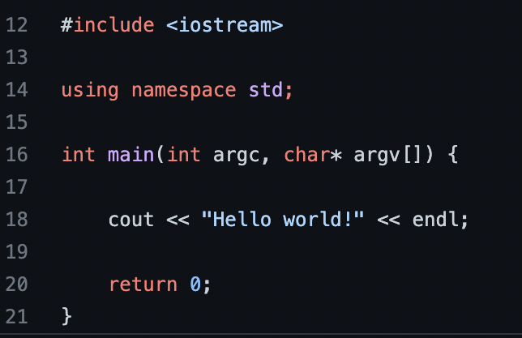

# Hello!

This is my home page! My name is Juliana Mae Recto and I am a student at [Cal State Fullerton](http://www.fullerton.edu/) and my major is Computer Science.

## Computer Science Projects

My GitHub page is http://github.com/ilymae.

### CPSC 120

* Lab 6

    Lab 6, Part 2 was one of my favorite labs. This lab which required us students to complete a guessing game, allowed me to choose how to control a game that allowe user input. The things I learned from this lab made me understand and realize that so much can be made by altering small things that contol how an output is created. While implementing booleans and while statements I was able to create a small little game that could be played multiple times without always having the same result. This has got ot be my favorite because it made me realize that with a little bit of creativity I can create a story.
    
    
    
* Lab 1

    Lab 1. Even though this lab may seem a little silly to include I think it's one of the most important because it was the beginning of a journey. Even though the first outcome was "Hello World" I was able to realize how much I can create from the tips of my fingers. I was able to change the output by messing with the code just a little bit and print anything my heart desires. I was also able to learn the importance of headers, which later on would be very important in future projects.
    
    
    
* Lab 3

    Lab 3, Part 2 was one of my other favorite labs from this class because it was the start of incorporating a lot of the fundamentals that we have learned from the class. We were able to learn how to incorporate user input, and converting measurement from said input. We were able to use coding to be helpful in real life circumstances, while sitll being able to incorporate math and so much more. More things I've learned from this class was being able to use formulas, cin, cout, and doubles to be able to calculate the output at a more efficient and concise way.
